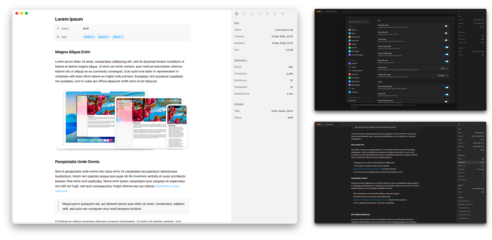

# File Metadata

A sidebar panel for [Obsidian](https://obsidian.md) that shows file info, text statistics, and a document outline — without touching your frontmatter.

## Features

- **File info** — name, full path, folder, created/modified dates, size
- **Details** — frontmatter tags, backlinks count, and all frontmatter properties
- **Text statistics** — words, characters, sentences, paragraphs, estimated pages, reading time, readability score
- **Link & code counts** — internal/external links, fenced code blocks
- **Document outline** — clickable headings indented by level
- **Image metadata** — dimensions, colour space, camera (EXIF via [exifr](https://github.com/MikeKovarik/exifr))
- **Collapsible sections** — click any section header to collapse or expand it
- **Click to copy** — click any row to copy its value; right-click for more options
- **Date format** — choose between short, long, or relative date display
- **Style Settings support** — customise colours, spacing, and layout via the [Style Settings](https://github.com/mgmeyers/obsidian-style-settings) plugin
- **Configurable** — toggle individual fields and sections on or off in Settings

## Installation

### Community plugins

1. **Settings → Community plugins → Browse** → search **File Metadata**
2. **Install** → **Enable**

### Manual

1. Grab `main.js`, `manifest.json`, and `styles.css` from the [latest release](https://github.com/aicayzer/obsidian-file-metadata/releases/latest)
2. Drop them into `.obsidian/plugins/file-metadata/` inside your vault
3. **Settings → Community plugins** → enable **File Metadata**

## Usage

Click the **ⓘ** icon in the left ribbon, or run **File Metadata: Open File Metadata panel** from the command palette.

The panel lives in the right sidebar and updates as you switch files or edit.

### Collapsible sections

Click any section header (File, Statistics, Outline) to collapse or expand it. The collapsed state is remembered for the duration of the session.

### Context menu

Right-click any row to copy just the value, or copy the full "Label: Value" pair.

## Settings

**Settings → File Metadata**

### File

| Setting | Default | Description |
|---|---|---|
| Show file name | On | Display the file name (click copies full path) |
| Show file path | Off | Display the full vault path |
| Show folder | On | Display the parent folder |
| Show created date | On | Creation date and time |
| Show modified date | On | Last modified date and time |
| Show file size | On | Size on disk |
| Date format | Short | Choose **Short** (5 Mar 2026, 14:30), **Long** (Wed, 5 March 2026, 14:30), or **Relative** (3h ago) |
| Folder click copies | Vault path | Choose **Vault path** or **Obsidian URI** (`obsidian://open?vault=…`) |

### Details

| Setting | Default | Description |
|---|---|---|
| Show Details section | On | Toggle the entire section |
| Show tags | On | Frontmatter and inline tags |
| Show backlinks count | On | Number of notes linking to this file |
| Show properties | On | All frontmatter key-value pairs |

### Statistics

| Setting | Default | Description |
|---|---|---|
| Show Statistics section | On | Toggle the entire section |
| Show sentences | On | Sentence count |
| Show paragraphs | On | Paragraph count |
| Show estimated pages | On | Estimated page count |
| Words per page | 300 | Used for the page estimate |
| Show reading time | On | Estimated reading time based on word count |
| Reading speed (wpm) | 200 | Words per minute for the reading time estimate |
| Show readability score | Off | Flesch reading ease (0–100); higher = easier to read |
| Show link counts | Off | Internal ([[wikilinks]]) and external link counts |
| Show code block count | Off | Number of fenced code blocks |

### Outline

| Setting | Default | Description |
|---|---|---|
| Show Outline section | On | Toggle the heading outline |

### Behaviour

| Setting | Default | Description |
|---|---|---|
| Click to copy | On | Click any row to copy its value |

## Style Settings

If you have the [Style Settings](https://github.com/mgmeyers/obsidian-style-settings) plugin installed, File Metadata exposes the following customisation options under **Style Settings → File Metadata**:

| Option | Type | Default |
|---|---|---|
| Section header colour | Themed colour | Text normal |
| Row label colour | Themed colour | Text muted |
| Row value colour | Themed colour | Text normal |
| Outline item colour | Themed colour | Text muted |
| Section divider opacity | Slider (0–1) | 0.5 |
| Spacing above divider | Number (px) | 12 |
| Label column width | Slider (20–60%) | 40% |

Without Style Settings installed, the plugin uses sensible defaults and looks identical.

## Future improvements

- Reveal file/folder in system file explorer (Finder/Explorer)
- Configurable section ordering in settings

## Attribution

Sidebar styling draws on the approach used by [Simple File Info](https://github.com/lukas-cap/obsidian-simple-file-info) (Lukas Capkovic), which uses Obsidian's built-in `tree-item` components. EXIF parsing is handled by [exifr](https://github.com/MikeKovarik/exifr) (Mike Kovařík).

## License

[MIT](LICENSE)
